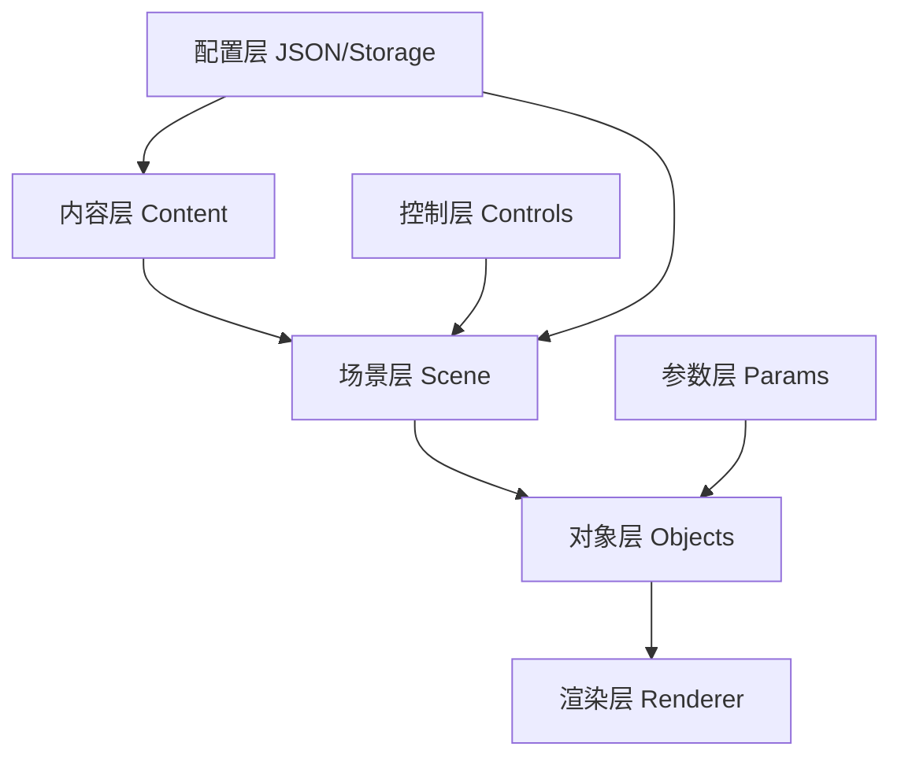
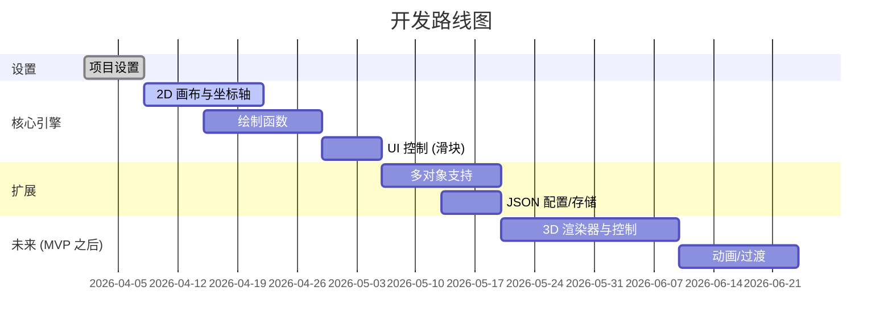

# 数学可视化系统项目方案

> 文档版本：V1.0  
> 整合来源：README.md（技术选型版）、design.md（技术方案 V1.1）、deep-research-report-zh.md（深度研究报告）

---

## 1. 项目概述与定位

### 1.1 项目目标

构建一个基于 React 的**交互式数学可视化平台**，具备以下核心能力：

- 多数学主题（线性代数 / 微积分 / 函数 / 解析几何）
- 2D / 3D 可视化能力
- 参数驱动交互
- JSON 配置驱动页面
- 模块化、可扩展架构
- 多函数/多对象对比展示

### 1.2 项目定位

本项目是一个基于 **React** 的数学可视化平台，目标不是单纯做"函数画图工具"，而是构建一套可以持续扩展的：

- 数学知识组织系统
- 2D / 3D 可视化引擎
- 参数交互系统
- 配置驱动页面系统
- 模块化数学对象系统
- 面向教学的"书本式"内容平台

### 1.3 适用内容范围

- 线性代数（向量、矩阵变换、特征值与特征向量）
- 微积分（极限、导数、积分面积）
- 函数与图像
- 解析几何
- 向量场、曲面、参数方程
- 后续可扩展到概率统计、微分方程、信号处理等

---

## 2. 设计目标与原则

### 2.1 核心设计原则

#### 2.1.1 数据驱动（核心）

页面通过 JSON 配置生成：

```json
{
  "type": "function",
  "expr": "sin(x)"
}
```

**核心理念：页面 = 配置 + 引擎**

#### 2.1.2 分层架构

```text
数学模型层（Math）
        ↓
渲染层（Renderer）
        ↓
交互层（Interaction）
```

#### 2.1.3 模块化

- 统一 2D / 3D 模板
- 可插拔数学对象
- 可扩展控制组件

#### 2.1.4 声明式渲染

```text
Scene = Objects + Config
```

### 2.2 核心目标

1. 用统一方式展示数学对象，而不是每个页面单独写死
2. 支持 2D 和 3D 两种场景，但共享尽量多的结构
3. 支持参数交互，页面上的参数变化能实时驱动可视化更新
4. 支持多个数学对象同时展示和对比
5. 支持网页直接修改配置并保存
6. 支持按"章节/小节/页面"的方式组织内容，像一本数学书
7. 后续可以接动画、讲解、课程编排、AI 自动生成内容

### 2.3 非目标（第一版不建议直接做成）

- 完整版 GeoGebra
- 完整版 Manim
- 完整版 Mathematica
- 重型脚本编辑器

第一版最重要的是把"架构"先做对。

---

## 3. 开源项目调研与借鉴

### 3.1 React Three Fiber 的启发

- 把三维对象做成 React 组件
- 用声明式方式组织场景
- 状态变化自动驱动场景更新

### 3.2 Mafs 的启发

- 2D 数学图形组件化
- 坐标系、网格、曲线、点、向量等对象拆分清楚
- 强调视觉一致性和测试稳定性

### 3.3 manim-web 的启发

- Scene / Object / Animation 的三层思路
- 数学图形不只是"静态画出来"，还要有转场、演化、变换
- 适合未来做教学演示

### 3.4 Grafar 的启发

- 数据和可视化之间保持响应式关系
- 参数变化后图形自动更新
- 更偏"数学对象驱动"，适合做动态场景

### 3.5 MathBox 的启发

- 3D 数学可视化中，坐标轴、网格、标注、关系表达非常重要
- 适合做高质量展示型页面
- 适合后续引入更高级的视觉效果

### 3.6 Euclid.js / CindyJS 的启发

- 2D 几何对象需要稳定的几何基础能力
- 几何变换、交点、构造关系，最好有独立的数学基础层
- 后期如要做几何教学，插件化和脚本化会很有价值

---

## 4. 技术架构设计（四层架构）

建议采用四层结构：



### 4.1 内容层

负责"像书一样组织内容"，例如：

- 线性代数
- 微积分
- 函数与图像
- 解析几何

内容层的最小单位是：

- 章节
- 小节
- 页面

### 4.2 场景层

负责描述一个页面是什么场景：

- 2D
- 3D
- 混合展示
- 对比展示

### 4.3 对象层

负责描述页面里有哪些数学对象：

- 函数曲线
- 向量
- 平面
- 曲面
- 坐标系
- 网格
- 切线
- 面积区域
- 参数轨迹

### 4.4 渲染层

负责把对象真正画到屏幕上：

- 2D：Canvas 或 SVG
- 3D：Three.js / React Three Fiber

---

## 5. 技术选型

### 5.1 前端框架

**推荐：React + TypeScript + Vite**

#### 选择理由

- React 适合做组件化数学对象
- TypeScript 适合复杂配置、场景、对象定义
- Vite 适合快速开发和调试
- 组件化能力强（适合"数学对象组件化"）
- 生态成熟
- 易与可视化库结合
- 支持声明式渲染（关键）

#### 可选替代

| 框架     | 评价          |
| ------ | ----------- |
| Vue    | 易上手，但生态略弱   |
| Svelte | 性能好，但生态不成熟  |
| 原生 JS  | 不推荐（不可维护） |

### 5.2 2D 渲染

**推荐：Canvas 为主，必要时补 SVG**

#### 选择理由

- 大量点、线、曲线时 Canvas 更高效
- 适合数学图像采样
- 可以统一控制坐标系、缩放、平移、线宽、抗锯齿策略

#### 适用场景

- 函数曲线
- 坐标轴
- 网格
- 向量
- 2D 几何
- 面积填充
- 轨迹动画

#### 可选方案

| 技术     | 评价          |
| ------ | ----------- |
| SVG    | 简单但性能差      |
| D3.js  | 偏数据，不适合复杂交互 |
| PixiJS | 可选（偏游戏）     |

### 5.3 3D 渲染

**推荐：Three.js + React Three Fiber**

#### 选择理由

- Three.js 是 Web 3D 基础方案
- React Three Fiber 能把 3D 场景 React 化
- 适合做交互场景、旋转、缩放、参数曲面、三维向量
- WebGL 标准方案
- 支持复杂交互（旋转/缩放）

#### 适用场景

- 3D 坐标系
- 曲面
- 平面
- 线性变换
- 三维向量
- 视角交互

#### 可选方案

| 技术         | 评价       |
| ---------- | -------- |
| Babylon.js | 重型引擎     |
| 原生 WebGL   | 开发成本极高 |

### 5.4 数学表达式引擎

**推荐：mathjs**

#### 作用

- 解析表达式
- 计算函数值
- 支持参数替换
- 支持基础符号计算能力

#### 适合范围

- `sin(x)`
- `a * cos(x + b)`
- 参数方程
- 简单矩阵运算
- 常见数学表达式

#### 可选方案

| 工具       | 评价     |
| -------- | ------ |
| nerdamer | 更偏符号计算 |
| 自己实现     | 不现实  |

### 5.5 状态管理

**推荐：Zustand**

#### 原因

- 简单、轻量
- 无样板代码
- 易与 React Hooks 集成
- 非常适合图形参数、场景配置、交互状态
- 比 Redux 更省样板代码

#### 可选方案

| 工具            | 评价 |
| ------------- | -- |
| Redux Toolkit | 重  |
| Jotai         | 可选 |

### 5.6 UI 组件库

**推荐：Ant Design 或 MUI**

#### 用途

- 控制面板
- 参数滑块
- 输入框
- 开关
- 颜色选择
- 布局容器
- 配置编辑器

### 5.7 表达式输入 / 编辑

**建议分阶段**

- 第一版：普通输入框 + JSON 编辑
- 第二版：Monaco Editor
- 后续：LaTeX 公式编辑、表达式校验、提示系统

### 5.8 数据存储

#### 第一版

- localStorage

#### 后续

- 后端数据库
- 用户配置同步
- 课程内容版本管理
- 团队协作编辑

### 5.9 工具链

#### 构建工具

**Vite（推荐）**

- 启动快
- 构建快
- 适合 React

#### 语言

**TypeScript（强烈推荐）**

- 类型安全
- 适合复杂系统

---

## 6. 核心抽象设计

### 6.1 场景 Scene

Scene 是页面的最高级单位。

Scene 负责定义：

- 渲染类型：2D / 3D
- 坐标范围
- 默认视角
- 背景与主题
- 对象列表
- 控制项列表

一个 Scene 代表一个完整页面。

### 6.2 数学对象 Object

所有可视化内容都应该抽象成对象。

建议对象统一包含：

- `type`：对象类型
- `data`：数学数据
- `style`：视觉样式
- `params`：可响应参数
- `visible`：是否显示
- `zIndex`：层级

对象类型示例：

- function
- point
- vector
- line
- segment
- plane
- surface
- matrix-transform
- area-fill
- curve
- axis
- grid

### 6.3 参数 Params

参数是整个系统动态变化的关键。

例如：

- `a`：幅值
- `b`：相位
- `k`：斜率
- `theta`：旋转角
- `x0`：平移量

参数变化后需要同步驱动：

- 数学表达式重新计算
- 对象几何数据更新
- 场景重绘

### 6.4 控制项 Controls

控制项是参数的 UI 映射。

常见类型：

- slider
- input
- toggle
- select
- color picker
- range
- checkbox

控制项应该由配置驱动，而不是在页面里硬编码。

---

## 7. 内容组织方式

建议把整个系统组织成"教材结构"。

```text
数学可视化系统
├── 第一章：函数与图像
│   ├── 1.1 直线与斜率
│   ├── 1.2 正弦与余弦
│   ├── 1.3 参数变化
│
├── 第二章：微积分
│   ├── 2.1 极限
│   ├── 2.2 导数
│   ├── 2.3 积分面积
│
├── 第三章：线性代数
│   ├── 3.1 向量
│   ├── 3.2 矩阵变换
│   ├── 3.3 特征值与特征向量
```

每个页面都对应一个 Scene。

这样做的好处是：

- 内容路径清晰
- 便于教学
- 便于后期扩展课程系统
- 便于加入"章节导航""目录""进度记录"

---

## 8. JSON 配置方案与 Schema

第一版建议采用 JSON 作为页面配置格式。

### 8.1 配置结构示意

```json
{
  "id": "calculus-derivative-01",
  "title": "导数与切线",
  "scene": {
    "type": "2d",
    "bounds": { "xMin": -10, "xMax": 10, "yMin": -5, "yMax": 5 }
  },
  "params": {
    "a": 1,
    "b": 0
  },
  "objects": [
    {
      "type": "function",
      "expr": "a * sin(x + b)",
      "style": {
        "color": "#1677ff",
        "lineWidth": 2
      }
    }
  ],
  "controls": [
    {
      "param": "a",
      "type": "slider",
      "min": 0,
      "max": 5,
      "step": 0.1,
      "label": "幅值"
    }
  ]
}
```

### 8.2 这套配置的作用

- 页面可复用
- 内容和渲染分离
- 支持导入导出
- 支持网页编辑后保存
- 适合后续做内容管理后台

### 8.3 配置字段说明

- **scene**：包含全局设置（2D 与 3D、坐标轴范围等）
- **objects**：可绘制项数组。每个都有 `type`（例如 `"function"`、`"vector"`、`"plane3D"`）和数据
- **params**：顶层对象（在 UI 状态中）保存当前参数值
- **controls**：描述 UI 元素。每个将一个 UI 控件链接到一个参数

---

## 9. 统一模板设计

为了保证一致性，建议所有页面都基于统一模板。

### 9.1 2D 模板

2D 页面默认包含：

- 坐标轴
- 网格
- 视图边界
- 对象层
- 控制面板

### 9.2 3D 模板

3D 页面默认包含：

- 三维坐标系
- 相机
- 灯光
- 控制器
- 对象层
- 控制面板

### 9.3 统一模板的价值

- 风格统一
- 交互一致
- 未来扩展新对象时成本低
- 页面不会散掉

---

## 10. 插件系统设计

插件系统是这个项目后续能不能做大的关键。

### 10.1 为什么要插件化

因为数学对象种类很多，不可能全部写死在主工程里。

比如后续可能增加：

- 函数图像插件
- 向量场插件
- 微积分插件
- 线性代数插件
- 几何构造插件
- 物理仿真插件

### 10.2 插件职责

每个插件负责：

- 解析自己的数据格式
- 提供默认配置
- 定义渲染方式
- 定义交互方式
- 定义可被控制的参数
- 定义导出能力

### 10.3 插件结构建议

每个插件最好包含：

- metadata
- schema
- renderer
- controller
- defaultStyle
- examples

### 10.4 插件系统收益

- 扩展能力强
- 业务团队可独立开发不同数学模块
- 后期可做社区生态
- 适合做课程包或专题包

---

## 11. 动画系统设计

动画系统建议放在第二阶段，但架构上要提前预留。

### 11.1 动画的意义

数学可视化如果只有静态图，教育效果有限。

动画能表达：

- 变化过程
- 变换过程
- 极限逼近
- 导数变化
- 面积累积
- 线性变换前后对比

### 11.2 动画对象

动画可以作用于：

- 数值参数
- 几何对象
- 相机视角
- 显隐状态
- 颜色、透明度、线宽

### 11.3 动画类型建议

- 淡入淡出
- 平移
- 缩放
- 旋转
- 形变
- 过渡插值
- 路径跟随
- 参数驱动动画

### 11.4 动画系统的设计方向

建议采用"时间轴 + 状态插值"的方式，而不是写死一串脚本。

也就是：

- 起始状态
- 目标状态
- 插值函数
- 持续时间
- easing 曲线

这样更适合做教学型动画。

---

## 12. 交互系统设计

### 12.1 交互类型

- 参数滑块
- 视角旋转
- 缩放
- 平移
- 对象显隐切换
- 鼠标悬停提示
- 点击选中对象

### 12.2 交互原则

- 低延迟
- 立即反馈
- 状态可回溯
- 参数变化可记录
- 交互行为尽量统一

### 12.3 2D 和 3D 的交互区别

**2D 主要是：**

- 平移
- 缩放
- 局部选择

**3D 主要是：**

- 旋转视角
- 轨道控制
- 相机距离调整

---

## 13. 多函数对比能力

### 13.1 支持内容

同一坐标系下绘制多个函数：

- `sin(x)`
- `cos(x)`
- `a * sin(x)`
- 分段函数
- 近似函数
- 原函数与导函数对比

### 13.2 设计要求

- 自动分配颜色
- 支持图例
- 支持单独显示/隐藏
- 支持线宽区分
- 支持重点函数高亮

### 13.3 应用场景

- 函数比较
- 导数比较
- 参数变化比较
- 拟合结果比较
- 教学演示

---

## 14. 项目目录结构

```text
src/
├── core/
│   ├── scene/
│   ├── renderer/
│   ├── math/
│   ├── interaction/
│   ├── plugin/
│
├── components/
│   ├── canvas2d/
│   ├── canvas3d/
│   ├── controls/
│   ├── layout/
│   ├── editor/
│
├── pages/
│   ├── calculus/
│   ├── linear-algebra/
│   ├── geometry/
│
├── configs/
├── assets/
├── hooks/
├── utils/
├── store/
```

---

## 15. 分阶段实施计划

### 阶段 1：MVP

目标是先跑通最核心链路。

#### 交付内容

- React + TypeScript + Vite 项目初始化
- 2D 画布模板
- 坐标轴和网格
- 函数曲线绘制
- 参数滑块
- JSON 配置加载
- 多函数对比
- localStorage 保存

#### 阶段目标

先做成一个"可配置的函数可视化页面"。

### 阶段 2：统一场景体系

#### 交付内容

- 章节结构
- Scene 抽象
- 对象抽象
- 控制项抽象
- 统一主题风格
- 2D 模板标准化

#### 阶段目标

从"单页 demo"变成"可扩展平台"。

### 阶段 3：3D 能力

#### 交付内容

- Three.js / R3F 接入
- 3D 坐标系
- 视角控制
- 曲面、平面、向量
- 3D 场景配置

#### 阶段目标

支持线代、空间几何、三维函数展示。

### 阶段 4：动画与课程系统

#### 交付内容

- 时间轴
- 对象变换
- 参数动画
- 教学步骤
- 章节播放模式

#### 阶段目标

从"可视化工具"升级成"教学平台"。

### 阶段 5：插件与生态

#### 交付内容

- 插件 API
- 对象注册机制
- 独立数学模块包
- 可视化主题包
- 分享与导入导出

#### 阶段目标

把平台做成可扩展生态。

### 开发路线图



---

## 16. 技术风险与对策

### 16.1 数学对象越来越多，架构容易乱

**对策：** 坚持对象标准化和插件化。

### 16.2 2D/3D 混在一起后维护复杂

**对策：** 场景层统一，渲染层分离。

### 16.3 表达式解析不稳定

**对策：** 优先使用成熟数学表达式库，不要自己从零写解析器。

### 16.4 页面配置变复杂

**对策：** JSON schema 必须尽早定下来。

### 16.5 动画系统容易做成脚本地狱

**对策：** 使用时间轴、状态插值、统一动画接口。

### 16.6 渲染性能

**对策：**

- 降采样
- 节流

---

## 17. 候选项目对比表

| 项目 / 仓库                           | 网址                           | 语言  | ★ | 相关性 (1–10) | 值得借鉴的关键特性                      | 许可证 |
|------------------------------------------|-------------------------------|-------|----|------------------|---------------------------------------------|---------|
| **react-three-fiber** (R3F)              | pmndrs/react-three-fiber      | TS    | 24k+ | 10               | 声明式 3D 场景、`<Canvas>`/`<mesh>` jsx | MIT     |
| **Three.js**                             | mrdoob/three.js               | JS    | 170k | 9                | 3D 引擎、几何体、材质（R3F 的基础） | MIT     |
| **manim-web**                            | maloyan/manim-web            | TS    | 330  | 8                | 场景与动画、丰富的数学对象（FunctionGraph、VectorField） | MIT     |
| **Mafs (stevenpetryk)**                  | stevenpetryk/mafs            | TS    | 3.4k | 9                | React 数学组件（坐标轴、图形、向量）; 侧重 2D | MIT     |
| **Grafar**                               | thoughtspile/grafar          | TS    | 589  | 7                | 响应式 3D 数学图形（参数曲线、曲面） | MIT     |
| **MathBox**                              | unconed/mathbox              | JS    | 1.5k | 7                | WebGL 数学可视化（坐标轴、网格、LaTeX）       | MIT     |
| **Euclid.js (Mathigon)**                 | mathigon/euclid.js           | TS    | 132  | 6                | 2D 几何原语（点、线、圆）         | MIT     |
| **CindyJS**                              | CindyJS/CindyJS              | JS    | 527  | 5                | 交互式几何框架（CindyScript 解释器） | Apache-2.0 |

---

## 18. 最终推荐的技术组合

### 主体技术栈

- React
- TypeScript
- Vite
- Zustand
- Ant Design / MUI
- mathjs

### 2D 渲染

- Canvas

### 3D 渲染

- Three.js
- React Three Fiber

### 编辑能力

- JSON 编辑
- 后续接 Monaco Editor

### 存储

- localStorage 起步
- 后续接后端

---

## 19. 结论

本项目本质：

```text
数学表达 → 数据模型 → 渲染 → 交互
```

核心思想：

> 用 React 做外壳，用 JSON 做配置，用数学对象做中间层，用 Canvas / Three.js 做渲染层，最后用统一场景模板把所有内容串起来。

目标：

> 构建一个"数学可视化引擎 + 教学平台"

它不是一个单纯的绘图页面，而是一个可持续扩展的**数学可视化平台**。

---

## 20. 下一步最值得做的三件事

1. 先定 JSON Schema
2. 先做 2D 场景和函数绘图
3. 先把"参数控制 + 多函数对比"跑通
