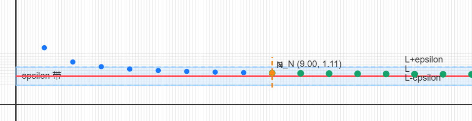

# NYCU 微积分甲一（109）读书笔记

- 课程来源：NYCU OCW，微积分甲(一)109 学年度（應用數學系 蘇承芳老師）
- 课纲页面：[课程链接](https://ocw.nycu.edu.tw/?course_page=all-course%2Fcollege-of-science%2Fam%2F%E5%BE%AE%E7%A9%8D%E5%88%86%E7%94%B2%E4%B8%80109%E5%AD%B8%E5%B9%B4%E5%BA%A6-calculus-i-academic-year-109-%E6%87%89%E7%94%A8%E6%95%B8%E5%AD%B8%E7%B3%BB-%E8%98%87%E6%89%BF%E8%8A%B3%E8%80%81)
- 目标：按章节完成「概念 -> 推导 -> 例题 -> 可视化截图」闭环

## Preliminaries and Notations（预备知识与符号）

### 0.1 Notation（符号表）

| 符号 | 含义 | 符号 | 含义 |
|---|---|---|---|
| $\forall$ | for all（对任意） | $\exists$ | there exists（存在） |
| $\exists !$ | there exists a unique（唯一存在） | $\implies$ | implies（推出） |
| $\iff$ | if and only if（当且仅当） | $\in$ | belongs to（属于） |
| $\mathbb{N}$ | natural numbers（自然数） | $\mathbb{Z}$ | integers（整数） |
| $\mathbb{Q}$ | rationals（有理数） | $\mathbb{R}$ | reals（实数） |
| $\epsilon$-$\delta$ | 极限语言（函数） | $\epsilon$-$N$ | 极限语言（数列） |

| 单词  |  缩写 | 含义 |
|---|---|---|
| such that | s.t. | 使得 |

补充：
$$
\mathbb{Q}=\left\{\frac{a}{b}\,\middle|\,a,b\in\mathbb{Z},\,b\neq 0\right\}
$$

### 0.2 Definitions（函数基本定义）

- Function：$f:A\to B$，对每个 $a\in A$ 唯一对应 $f(a)\in B$。
- Domain（定义域）：$A$。
- Codomain（陪域）：$B$。
- Range（值域）：$f(A)=\{f(a)\mid a\in A\}$。

### 0.3 Trigonometric Formulas（三角恒等式速查）

#### Double-Angle Formulas（倍角公式）
$$
\begin{align*}
\sin(2x) & = 2\sin x\cos x \\
\cos(2x) & = \cos^2x - \sin^2x \\
\tan(2x) & = \frac{2\tan x}{1 - \tan^2x}
\end{align*}
$$

#### Sum-and-Difference Formulas（和差公式）
$$
\begin{align*}
\sin(x\pm y)  &= \sin x \cos y \pm \cos x \sin y \\
\cos(x\pm y)  &= \cos x \cos y \mp \sin x \sin y
\end{align*}
$$

#### Product-to-Sum Formulas（积化和差）
$$
\begin{align*}
\sin x \cos y &= \frac{1}{2}\big[\sin(x+y) + \sin(x-y)\big] \\
\cos x \cos y &= \frac{1}{2}\big[\cos(x+y) + \cos(x-y)\big]
\end{align*}
$$

### 0.4 Linear Combination of Sine and Cosine（$a\cos x+b\sin x$ 化为单一三角函数）

目标：
$$
f(x)=a\cos x+b\sin x
$$
写成
$$
f(x)=R\sin(x+\varphi)
$$

推导：
$$
R\sin(x+\varphi)=R(\sin x\cos\varphi+\cos x\sin\varphi)
$$
对比系数得
$$
R\cos\varphi=b,\quad R\sin\varphi=a
$$
因此
$$
R=\sqrt{a^2+b^2},\quad
\sin\varphi=\frac{a}{R},\quad
\cos\varphi=\frac{b}{R}
$$
最终
$$
a\cos x+b\sin x=\sqrt{a^2+b^2}\,\sin(x+\varphi)
$$
其中 $\varphi$ 由 $(\sin\varphi,\cos\varphi)$ 象限确定。

---

## Chapter 1. Limits and Derivatives（极限与导数）

### 1.1 Sequence Limits（数列极限）

#### Problem（问题）

设
$$
a_n=\frac{n}{n+1},\quad n\in\mathbb{N}.
$$

当 $n=1,2,3,\dots$ 时，
$$
\frac12,\ \frac23,\ \frac34,\ \frac45,\dots
$$

问题是：
$$
\text{当 } n\to\infty \text{ 时，} a_n \text{ 会不会越来越接近某个数？}
$$

如果会，这个数是多少？

#### Observation（观察）

把它改写成
$$
a_n=\frac{n}{n+1}=1-\frac{1}{n+1}.
$$

观察到：
$$
0<\frac{1}{n+1}<1,\quad n\text{ 越大，}\frac{1}{n+1}\text{ 越小}.
$$

所以
$$
a_n=1-\frac{1}{n+1}
$$
看起来会越来越靠近 $1$。

也就是我们猜：
$$
\lim_{n\to\infty}\frac{n}{n+1}=1.
$$

但“看起来靠近”还不够精确，所以需要一个严格定义。

#### Definition（定义）

记号：
$$
a_n\to L
\quad\Longleftrightarrow\quad
\lim_{n\to\infty}a_n=L.
$$

定义：
$$
\forall \epsilon>0,\ \exists N\in\mathbb{N},\ \forall n>N,\ |a_n-L|<\epsilon.
$$

意思是：
$$
\text{无论要求多近 }(\epsilon>0),\ \text{只要 } n \text{ 够大，}a_n\text{ 就会落进 }(L-\epsilon,L+\epsilon).
$$

所以“数列极限”的本质不是“感觉上越来越近”，而是：
$$
\text{差 }|a_n-L|\text{ 可以小于任意给定的 }\epsilon.
$$

#### Computation（计算）

1. 问题描述：证明
$$
\lim_{n\to\infty} \frac{n}{n+1} = 1.
$$

2. 已知条件，目标：已知
$$
\forall \epsilon>0,\ \exists N\in\mathbb{N},\ \forall n>N,\ |a_n-L|<\epsilon.
$$

这里
$$
a_n=\frac{n}{n+1},\quad L=1.
$$

目标：对任意 $\epsilon>0$，找到 $N$，使得当 $n>N$ 时
$$
\left|\frac{n}{n+1}-1\right|<\epsilon.
$$

又
$$
\left| \frac{n}{n+1} - 1 \right| = \frac{1}{n+1},
$$
故只要 $\frac{1}{n+1}<\epsilon$，即 $n>\frac{1}{\epsilon}-1$。取 $N>\frac{1}{\epsilon}-1$，则当 $n>N$ 时有
$$
\left|\frac{n}{n+1}-1\right|<\epsilon,
$$
所以
$$
\lim_{n\to\infty} \frac{n}{n+1}=1.
$$

#### Concept（收敛与发散）

若
$$
\lim_{n\to\infty}a_n=L\in\mathbb{R},
$$
则称 $\{a_n\}$ 为 convergent sequence（收敛数列）。

若上述极限不存在，则称 $\{a_n\}$ 为 divergent sequence（发散数列）。

#### Examples（例）

判断下列数列是否收敛：

1. $a_n=(-1)^n$
2. $a_n=\sin n$
3. $a_n=2n+5$

解：

1. 在 $1,-1,1,-1,\dots$ 间震荡，不收敛。
2. 无固定趋近值，不收敛。
3. 当 $n\to\infty$ 时无界增大，不收敛于任何实数。

---

### 1.2 Function Limits（函数极限）
