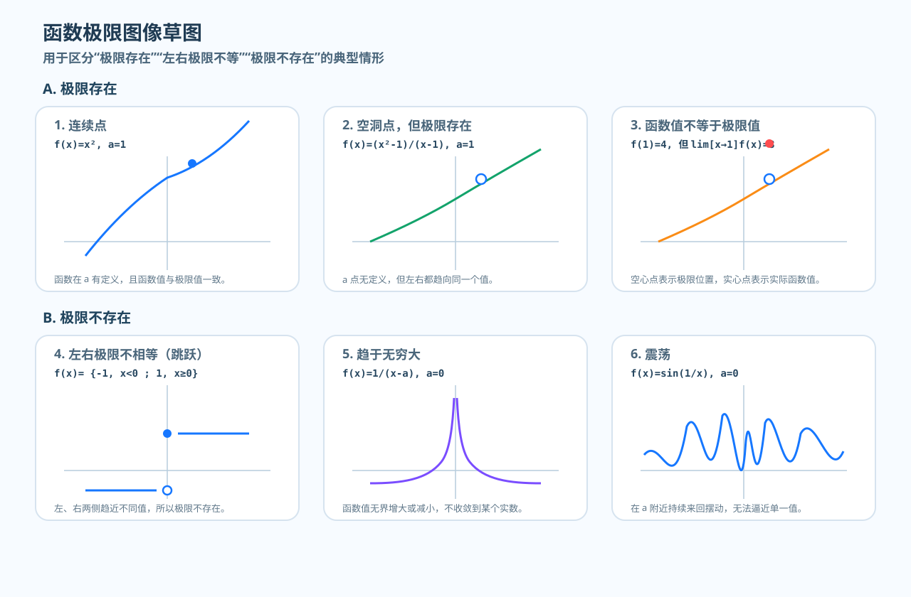
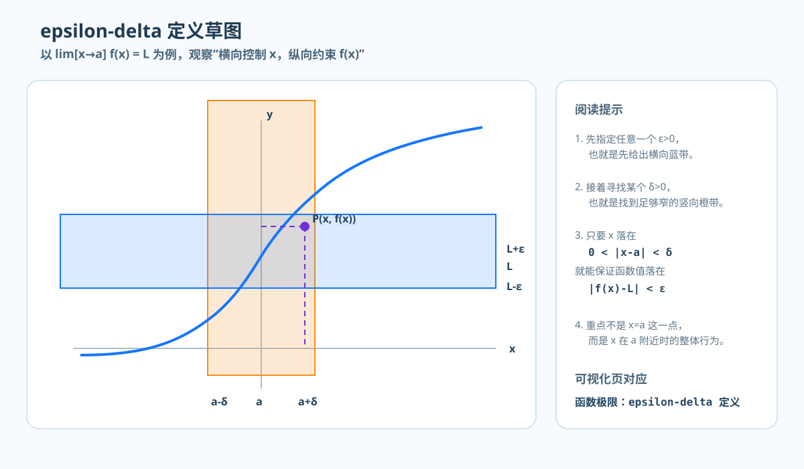

# NYCU 微积分甲一（109）读书笔记

- 课程来源：NYCU OCW，微积分甲（一）109 学年度（应用数学系，苏承芳老师）
- 课纲页面：[课程链接](https://ocw.nycu.edu.tw/?course_page=all-course%2Fcollege-of-science%2Fam%2F%E5%BE%AE%E7%A9%8D%E5%88%86%E7%94%B2%E4%B8%80109%E5%AD%B8%E5%B9%B4%E5%BA%A6-calculus-i-academic-year-109-%E6%87%89%E7%94%A8%E6%95%B8%E5%AD%B8%E7%B3%BB-%E8%98%87%E6%89%BF%E8%8A%B3%E8%80%81)
- 目标：按章节完成“概念 -> 推导 -> 例题 -> 可视化截图”的闭环

---

## 0. Preliminaries and Notations（预备知识与符号）

### 0.1 Symbol Table（符号表）

| 符号 | 含义 | 符号 | 含义 |
| --- | --- | --- | --- |
| $\forall$ | 对任意 | $\exists$ | 存在 |
| $\exists !$ | 唯一存在 | $\implies$ | 推出 |
| $\iff$ | 当且仅当 | $\in$ | 属于 |
| $\mathbb{N}$ | 自然数集 | $\mathbb{Z}$ | 整数集 |
| $\mathbb{Q}$ | 有理数集 | $\mathbb{R}$ | 实数集 |
| $\varepsilon$-$\delta$ | 函数极限语言 | $\varepsilon$-$N$ | 数列极限语言 |

常见缩写：

| 单词 | 缩写 | 含义 |
| --- | --- | --- |
| such that | s.t. | 使得 |

补充：

$$
\mathbb{Q}
=
\left\{
\frac{a}{b}
\;\middle|\;
a,b\in\mathbb{Z},\ b\neq 0
\right\}.
$$

### 0.2 Function Basics（函数基本定义）

设 $f:A\to B$。

- **Function**：对每个 $a\in A$，存在唯一的 $f(a)\in B$ 与之对应。
- **Domain**（定义域）：$A$。
- **Codomain**（陪域）：$B$。
- **Range**（值域）：$f(A)=\{f(a)\mid a\in A\}$。

### 0.3 Trigonometric Identities（三角恒等式速查）

#### 倍角公式

$$
\begin{aligned}
\sin(2x) &= 2\sin x\cos x, \\
\cos(2x) &= \cos^2 x-\sin^2 x, \\
\tan(2x) &= \frac{2\tan x}{1-\tan^2 x}.
\end{aligned}
$$

#### 和差公式

$$
\begin{aligned}
\sin(x\pm y) &= \sin x\cos y \pm \cos x\sin y, \\
\cos(x\pm y) &= \cos x\cos y \mp \sin x\sin y.
\end{aligned}
$$

#### 积化和差

$$
\begin{aligned}
\sin x\cos y &= \frac12\bigl[\sin(x+y)+\sin(x-y)\bigr], \\
\cos x\cos y &= \frac12\bigl[\cos(x+y)+\cos(x-y)\bigr].
\end{aligned}
$$

### 0.4 Linear Combination of Sine and Cosine（$a\cos x+b\sin x$ 化为单一三角函数）

目标：把

$$
f(x)=a\cos x+b\sin x
$$

写成

$$
f(x)=R\sin(x+\varphi).
$$

由和角公式，

$$
R\sin(x+\varphi)=R\sin x\cos\varphi + R\cos x\sin\varphi.
$$

对比 $\sin x$ 与 $\cos x$ 的系数，得

$$
R\cos\varphi=b,
\qquad
R\sin\varphi=a.
$$

于是

$$
R=\sqrt{a^2+b^2},
\qquad
\sin\varphi=\frac{a}{R},
\qquad
\cos\varphi=\frac{b}{R}.
$$

结论：

$$
a\cos x+b\sin x
=
\sqrt{a^2+b^2}\,\sin(x+\varphi),
$$

其中 $\varphi$ 由 $(\sin\varphi,\cos\varphi)$ 所在象限确定。

---

## 1. Chapter 1. Limits and Derivatives（极限与导数）

### 1.1 Sequence Limits（数列极限）

#### 例 1

设
$$
a_n=\frac{n}{n+1},\qquad n\in\mathbb{N}.
$$

前几项为
$$
\frac12,\ \frac23,\ \frac34,\ \frac45,\ \dots
$$

问题是：当 $n\to\infty$ 时，$a_n$ 是否趋近某个定值？

#### 观察

改写为
$$
a_n=\frac{n}{n+1}=1-\frac{1}{n+1}.
$$

由于
$$
\frac{1}{n+1}>0,\qquad \frac{1}{n+1}\to 0,
$$
所以直观上
$$
a_n\to 1,\qquad \lim_{n\to\infty}\frac{n}{n+1}=1.
$$

#### 定义（数列极限）

记号
$$
a_n\to L \quad\Longleftrightarrow\quad \lim_{n\to\infty}a_n=L.
$$

定义：若
$$
\forall \varepsilon>0,\ \exists N\in\mathbb{N},\ \forall n>N,\ |a_n-L|<\varepsilon,
$$

则称数列 $\{a_n\}$ 收敛到 $L$。

这意味着：无论给定多小的误差 $\varepsilon>0$，只要 $n$ 足够大，$a_n$ 就会落入区间
$$
(L-\varepsilon,\ L+\varepsilon)
$$
之内。换言之，极限的核心是 $|a_n-L|$ 可以小于任意给定的 $\varepsilon$。

#### 证明

$$
\left|\frac{n}{n+1}-1\right|=\frac{1}{n+1}.
$$
$$
\frac{1}{n+1}<\varepsilon \iff n>\frac{1}{\varepsilon}-1.
$$
$$
取任意\quad N>\frac{1}{\varepsilon}-1,
$$
$$
n>N \implies \left|\frac{n}{n+1}-1\right|<\varepsilon,
$$
故按定义 $\lim_{n\to\infty}\frac{n}{n+1}=1$。

#### 定义（收敛与发散）

若存在 $L\in\mathbb{R}$ 使得

$$
\lim_{n\to\infty}a_n=L,
$$

则称 $\{a_n\}$ 为 **收敛数列**。

若上述极限不存在，则称 $\{a_n\}$ 为 **发散数列**。

#### 例 2

判断下列数列是否收敛：

1. $a_n=(-1)^n$
2. $a_n=\sin n$
3. $a_n=2n+5$

解：

1. $(-1)^n$ 在 $1,-1,1,-1,\dots$ 间震荡，故发散。
2. $\sin n$ 不趋近某个固定值，故发散。
3. $2n+5\to+\infty$，不收敛于任何实数，故发散。

---

### 1.2 Function Limits（函数极限）

#### 例 1：极限与函数值无关

设
$$
A=\mathbb{R}\setminus\{1\},\qquad
f:A\to\mathbb{R},\ f(x)=\frac{x^3-1}{x-1},\qquad
g:\mathbb{R}\to\mathbb{R},\ g(x)=x^2+x+1.
$$

由于
$$
x^3-1=(x-1)(x^2+x+1),
$$
所以当 $x\neq 1$ 时，
$$
f(x)=x^2+x+1=g(x).
$$

也就是说，$f$ 与 $g$ 只在 $x=1$ 这一点不同：

- $f(1)$ 无定义；
- $g(1)=3$。

但当 $x\to 1$ 时，

$$
\lim_{x\to 1}f(x)=\lim_{x\to 1}g(x)=3.
$$

因此，**函数在点 $a$ 是否定义、以及 $f(a)$ 的取值，并不直接决定 $\lim_{x\to a}f(x)$；极限描述的是 $x$ 接近 $a$ 时的整体趋势。**

#### 图像直觉

从图像上看，函数极限常见为三类：

1. **极限存在**
   - 函数在该点有定义，且函数值等于极限值；
   - 函数在该点无定义，但左右两侧趋于同一值；
   - 函数在该点有定义，但函数值不等于极限值。

2. **左右极限不相等**
   - 常见于分段函数的跳跃间断。

3. **极限不存在**
   - 左右趋近行为不同；
   - 函数值无界；
   - 函数值持续震荡。

#### 定义（数列形式）

设 $A\subseteq\mathbb{R}$，$f:A\to\mathbb{R}$，且 $a$ 是 $A$ 的聚点。若存在 $L\in\mathbb{R}$，使得对任意数列 $\{x_n\}$，
$$
x_n\in A,\qquad x_n\neq a,\qquad x_n\to a
\quad\Longrightarrow\quad
f(x_n)\to L,
$$
则称
$$
\lim_{x\to a}f(x)=L.
$$

这个定义强调：**无论以何种方式逼近 $a$，函数值都必须趋近同一个 $L$。**

#### 命题：极限若存在，则唯一

函数极限一旦存在，其值只能有一个。

#### 例 2：震荡导致极限不存在

设
$$
f(x)=\sin\left(\frac{1}{x}\right),\qquad x\neq 0.
$$
取
$$
x_n=\frac{1}{2n\pi},\qquad
y_n=\frac{1}{2n\pi+\frac{\pi}{2}},
$$
则
$$
x_n\to 0,\qquad y_n\to 0,\qquad
f(x_n)=\sin(2n\pi)=0,\qquad
f(y_n)=\sin\left(2n\pi+\frac{\pi}{2}\right)=1.
$$

因此沿两列都趋于 $0$ 的点，函数值分别趋于 $0$ 与 $1$，故

$$
\lim_{x\to 0}\sin\left(\frac{1}{x}\right)
$$

不存在。

#### 定义（$\varepsilon$-$\delta$ 形式）

我们说
$$
\lim_{x\to a}f(x)=L
$$
是指
$$
\forall \varepsilon>0,\ \exists \delta>0,\ \forall x,\ 0<|x-a|<\delta \implies |f(x)-L|<\varepsilon.
$$

含义如下：

- $\varepsilon$ 控制函数值与 $L$ 的接近程度；
- $\delta$ 控制自变量 $x$ 与 $a$ 的接近程度；
- 只要 $x$ 足够靠近 $a$（但 $x\neq a$），就能保证 $f(x)$ 足够靠近 $L$。

#### 极限定理

若
$$
\lim_{x\to a}f(x)=A,\qquad \lim_{x\to a}g(x)=B,
$$
则：

1. **常数法则**：$\lim_{x\to a}c=c$。
2. **常数倍法则**：$\lim_{x\to a}cf(x)=c\lim_{x\to a}f(x)$。
3. **和法则**：
   $$
   \lim_{x\to a}(f(x)+g(x))=\lim_{x\to a}f(x)+\lim_{x\to a}g(x).
   $$
4. **积法则**：
   $$
   \lim_{x\to a}(f(x)g(x))
   =
   \left(\lim_{x\to a}f(x)\right)\left(\lim_{x\to a}g(x)\right).
   $$
5. **商法则**（$B\neq 0$）：
   $$
   \lim_{x\to a}\frac{f(x)}{g(x)}=\frac{\lim_{x\to a}f(x)}{\lim_{x\to a}g(x)}.
   $$

这些法则是后续计算函数极限的基本工具。下面用 $\varepsilon$-$\delta$ 定义给出证明。

#### 证明 1：常数法则

要证
$$
\lim_{x\to a}c=c.
$$

对任意 $\varepsilon>0$，任取 $\delta>0$。若 $0<|x-a|<\delta$，则
$$
|c-c|=0<\varepsilon.
$$
故由定义，
$$
\lim_{x\to a}c=c.
$$

重点：常数函数没有误差，故任意 $\delta$ 都成立。

#### 证明 2：常数倍法则

要证
$$
\lim_{x\to a}cf(x)=cA.
$$

若 $c=0$，则 $cf(x)\equiv 0$，由常数法则即得。以下设 $c\neq 0$。

对任意 $\varepsilon>0$，令
$$
\varepsilon_1=\frac{\varepsilon}{|c|}.
$$
由 $\lim_{x\to a}f(x)=A$，存在 $\delta>0$，使得
$$
0<|x-a|<\delta \implies |f(x)-A|<\varepsilon_1.
$$
于是
$$
|cf(x)-cA|=|c|\,|f(x)-A|<|c|\varepsilon_1=\varepsilon.
$$
故
$$
\lim_{x\to a}cf(x)=cA.
$$

重点：把目标误差 $\varepsilon$ 反推成 $f$ 的误差 $\varepsilon/|c|$。

#### 证明 3：和法则

要证
$$
\lim_{x\to a}(f(x)+g(x))=A+B.
$$

对任意 $\varepsilon>0$，由 $\lim_{x\to a}f(x)=A$，存在 $\delta_1>0$，使得
$$
0<|x-a|<\delta_1 \implies |f(x)-A|<\frac{\varepsilon}{2}.
$$
由 $\lim_{x\to a}g(x)=B$，存在 $\delta_2>0$，使得
$$
0<|x-a|<\delta_2 \implies |g(x)-B|<\frac{\varepsilon}{2}.
$$
取
$$
\delta=\min\{\delta_1,\delta_2\}.
$$
则当 $0<|x-a|<\delta$ 时，
$$
\begin{aligned}
|(f(x)+g(x))-(A+B)|
&=|(f(x)-A)+(g(x)-B)| \\
&\le |f(x)-A|+|g(x)-B| \\
&< \frac{\varepsilon}{2}+\frac{\varepsilon}{2}
=\varepsilon.
\end{aligned}
$$
故
$$
\lim_{x\to a}(f(x)+g(x))=A+B.
$$

重点：把误差 $\varepsilon$ 平分给两个函数，再用三角不等式合并。

#### 证明 4：积法则

要证
$$
\lim_{x\to a}(f(x)g(x))=AB.
$$

先把差拆开：
$$
f(x)g(x)-AB=f(x)(g(x)-B)+B(f(x)-A).
$$
因此
$$
|f(x)g(x)-AB|
\le |f(x)|\,|g(x)-B|+|B|\,|f(x)-A|.
$$

这里关键是先控制 $|f(x)|$。由 $\lim_{x\to a}f(x)=A$，取 $\varepsilon=1$，存在 $\delta_0>0$，使得
$$
0<|x-a|<\delta_0 \implies |f(x)-A|<1.
$$
故当 $0<|x-a|<\delta_0$ 时，
$$
|f(x)|\le |A|+1.
$$

现在对任意 $\varepsilon>0$，由 $\lim_{x\to a}g(x)=B$，存在 $\delta_1>0$，使得
$$
0<|x-a|<\delta_1 \implies |g(x)-B|<\frac{\varepsilon}{2(|A|+1)}.
$$
由 $\lim_{x\to a}f(x)=A$，存在 $\delta_2>0$，使得
$$
0<|x-a|<\delta_2 \implies |f(x)-A|<\frac{\varepsilon}{2(|B|+1)}.
$$

取
$$
\delta=\min\{\delta_0,\delta_1,\delta_2\}.
$$
则当 $0<|x-a|<\delta$ 时，
$$
\begin{aligned}
|f(x)g(x)-AB|
&\le |f(x)|\,|g(x)-B|+|B|\,|f(x)-A| \\
&\le (|A|+1)|g(x)-B|+|B|\,|f(x)-A| \\
&< (|A|+1)\frac{\varepsilon}{2(|A|+1)}
+ |B|\frac{\varepsilon}{2(|B|+1)} \\
&\le \frac{\varepsilon}{2}+\frac{\varepsilon}{2}
=\varepsilon.
\end{aligned}
$$
故
$$
\lim_{x\to a}(f(x)g(x))=AB.
$$

重点：积法则真正困难的地方不是拆式，而是先证明 $f(x)$ 在 $a$ 附近有界。

#### 证明 5：商法则

设 $B\neq 0$，要证
$$
\lim_{x\to a}\frac{f(x)}{g(x)}=\frac{A}{B}.
$$

先控制分母远离 $0$。由 $\lim_{x\to a}g(x)=B$，取
$$
\varepsilon_0=\frac{|B|}{2},
$$
则存在 $\delta_0>0$，使得
$$
0<|x-a|<\delta_0 \implies |g(x)-B|<\frac{|B|}{2}.
$$
于是
$$
|g(x)|\ge |B|-|g(x)-B|>\frac{|B|}{2}.
$$

再作差：
$$
\frac{f(x)}{g(x)}-\frac{A}{B}
=
\frac{B(f(x)-A)-A(g(x)-B)}{Bg(x)}.
$$
故
$$
\left|\frac{f(x)}{g(x)}-\frac{A}{B}\right|
\le
\frac{|B|\,|f(x)-A|+|A|\,|g(x)-B|}{|B|\,|g(x)|}
\le
\frac{2}{|B|}|f(x)-A|+\frac{2|A|}{|B|^2}|g(x)-B|.
$$

现在对任意 $\varepsilon>0$，取 $\delta_1,\delta_2>0$ 使得
$$
0<|x-a|<\delta_1 \implies |f(x)-A|<\frac{\varepsilon|B|}{4},
$$
$$
0<|x-a|<\delta_2 \implies |g(x)-B|<
\begin{cases}
\dfrac{\varepsilon |B|^2}{4|A|}, & A\neq 0,\\[4pt]
1, & A=0.
\end{cases}
$$
取
$$
\delta=\min\{\delta_0,\delta_1,\delta_2\}.
$$
则当 $0<|x-a|<\delta$ 时，
$$
\left|\frac{f(x)}{g(x)}-\frac{A}{B}\right|<\varepsilon.
$$
故
$$
\lim_{x\to a}\frac{f(x)}{g(x)}=\frac{A}{B}.
$$

重点：商法则的关键不是通分，而是先证明分母在极限点附近不会太小。
